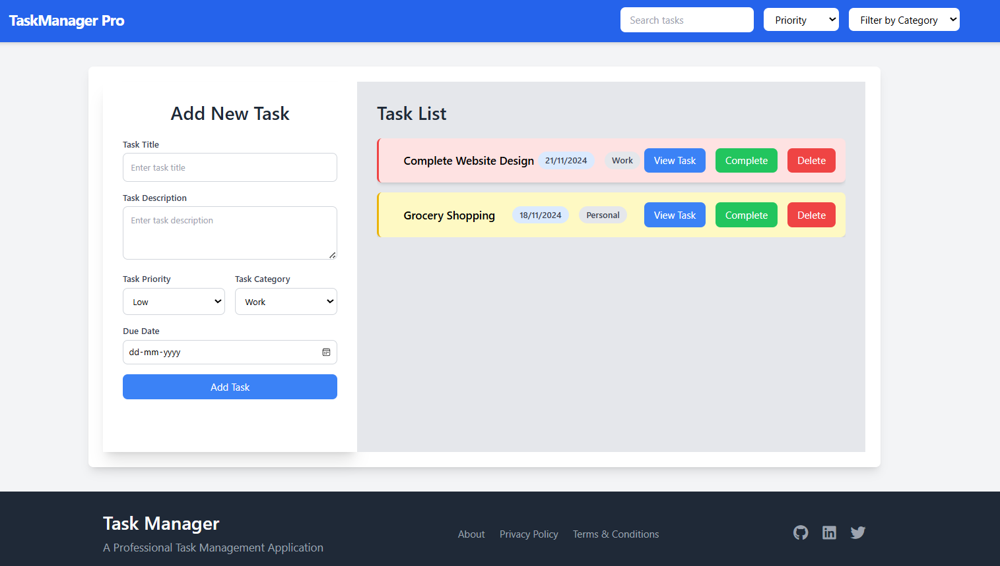
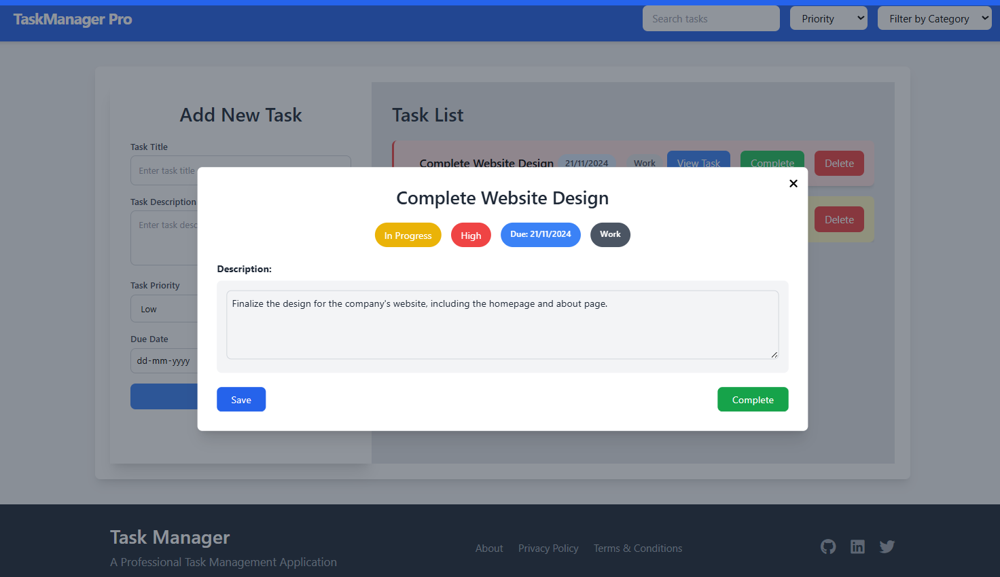
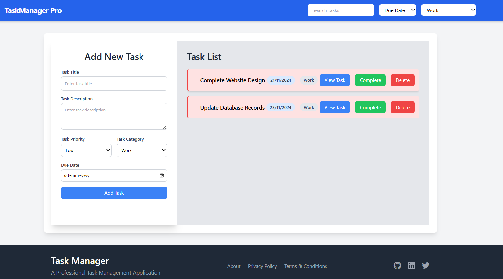
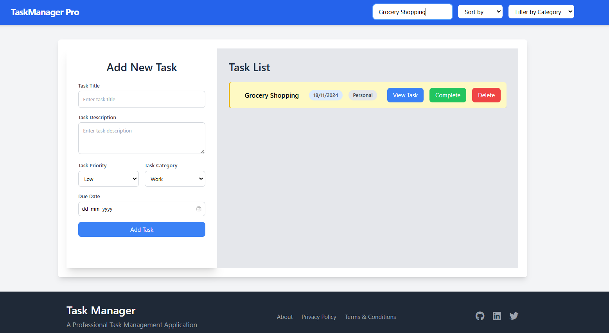

# Task Manager Web Project

## Overview
The **Task Manager** is a simple web application that allows users to efficiently manage and organize their tasks. With features like task creation, categorization, status tracking, and deadlines, the app helps users stay productive by prioritizing and monitoring their tasks in one place. It utilizes **local storage** to persist user data, ensuring that tasks remain saved across sessions.

## Features
- **Task Creation**: Add tasks with a title, description, due date, and priority.
- **Task Categorization**: Categorize tasks into different groups (e.g., Work, Personal).
- **Task Status**: Tasks can be marked as Pending, In Progress, or Completed.
- **Search and Filter**: Search tasks by title and filter them by status, category, or priority.
- **Task Editing & Deletion**: Edit existing tasks or delete tasks that are no longer needed.
- **Responsive Design**: The web app is fully responsive, making it accessible on both desktop and mobile devices.

## Assumptions Made During Development
- **Local Storage**: The application uses local storage to persist tasks, meaning no external database is required.
- **No User Authentication**: The application does not require a login system. It is designed for individual use, and tasks are stored locally in the browser.
- **Tech Stack**: 
   - **Frontend**: ReactJS
   - **Styling**: Tailwind CSS
- **Task Management**: Simple task management features are implemented, with no advanced features like recurring tasks or notifications for deadlines.

## Setup and Launch

### Prerequisites
To run this project locally, you need the following installed:
- **Node.js** (v16.x or above)
- **npm** (v7.x or above)

### Installation

1. Clone the repository:

   ```bash
   git clone https://github.com/your-username/task-manager-web.git
   cd task-manager-web
Install the dependencies:

bash
Copy code
npm install
Start the development server:

bash
Copy code
npm start
The app should now be running at http://localhost:3000.

Running the App
Once the app is running, you can:

Create, edit, and delete tasks.
Search and filter tasks by title, category, status, or priority.
View tasks in a responsive layout across both desktop and mobile devices.
Screenshots
Home Page:


Task Details:


Task Sorting & Filtering :


Task Searching :


Future Enhancements
Team Collaboration: Extend the app for team-based task management.
Task Reminders: Implement notifications and reminders for upcoming tasks.
Recurring Tasks: Allow users to set up recurring tasks (daily, weekly, etc.).
Task Dependencies: Add support for managing tasks with dependencies.
Advanced Search: Implement more advanced search and filtering options, such as searching by deadlines or tags.
